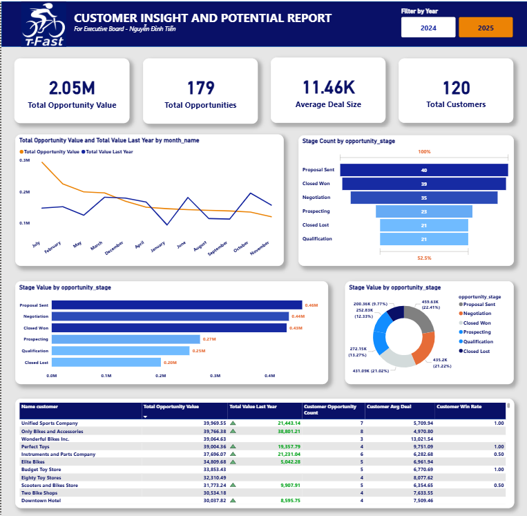
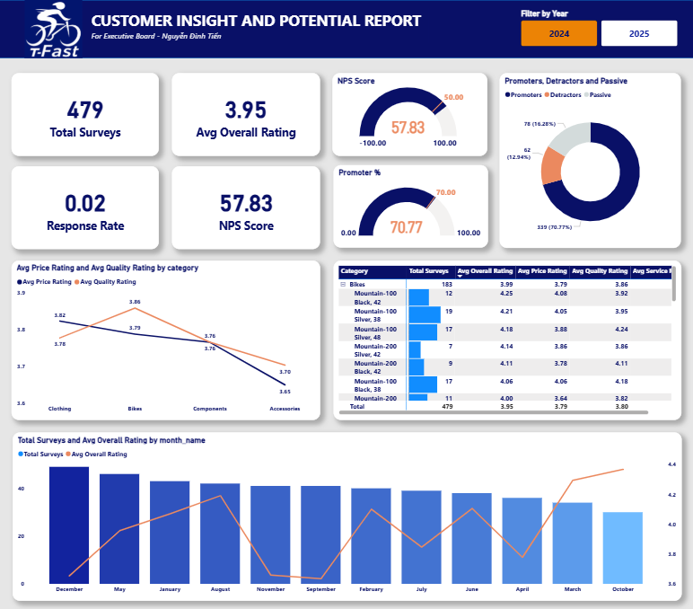
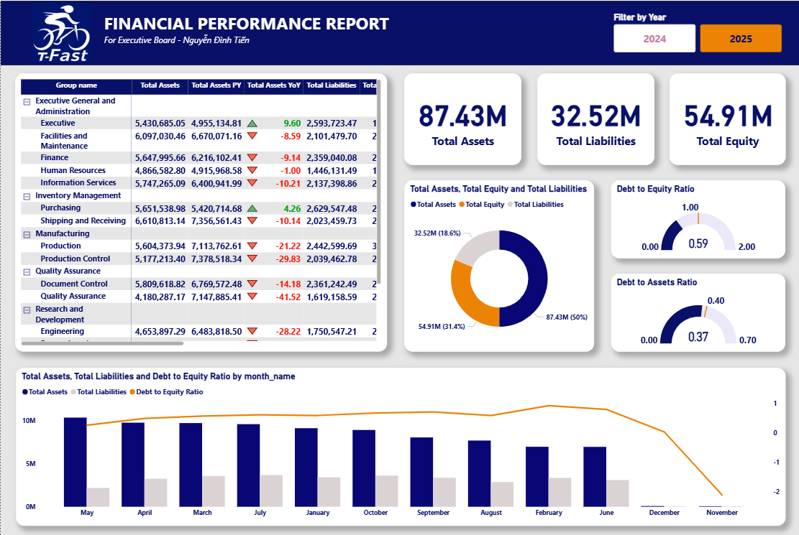
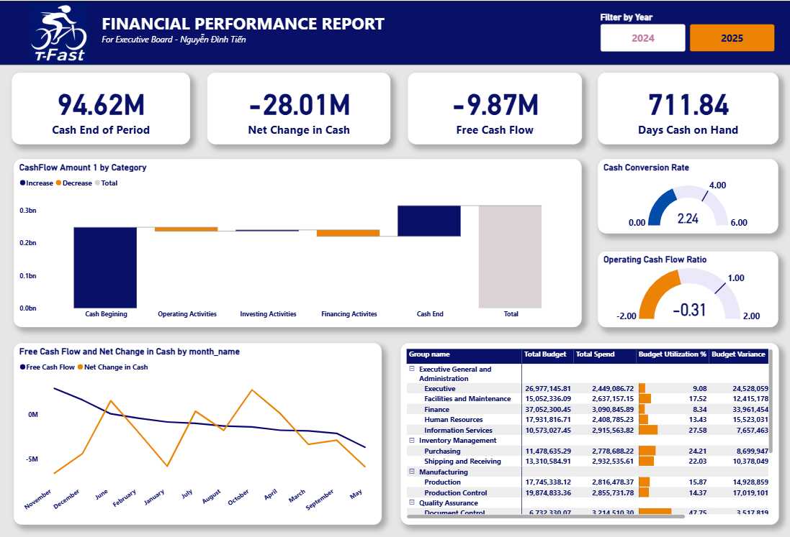
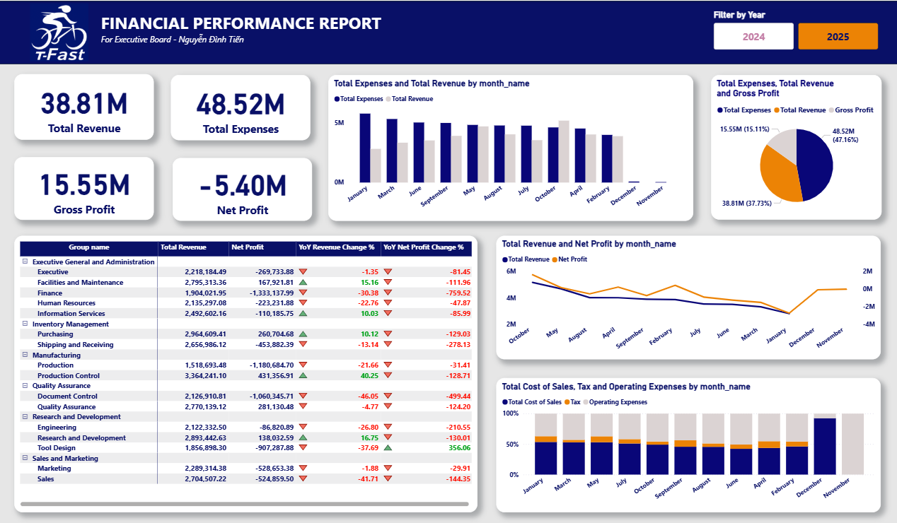
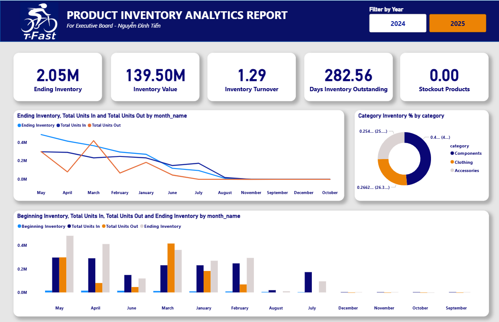
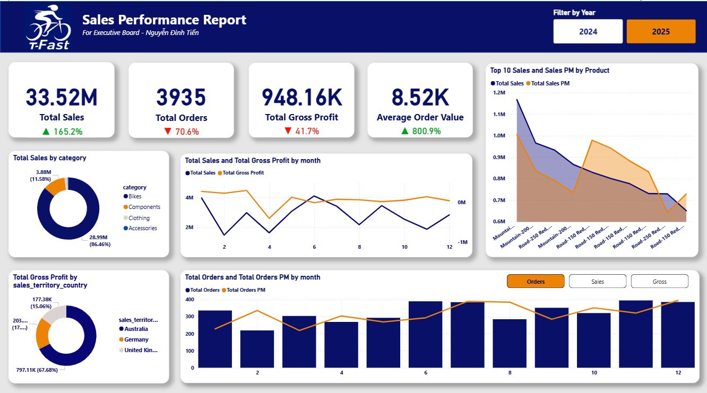

# Data Lakehouse Architecture for Enterprise Analytics using Microsoft Fabric

## Overview

This project implements a modern **Data Lakehouse Architecture** for enterprise analytics using **Microsoft Fabric**. It demonstrates best practices for building a scalable, maintainable data platform that integrates ERP data and delivers actionable business insights through multiple analytical layers.

## Architecture

The project follows the **medallion architecture** pattern with three distinct data layers:

### 🥉 Bronze Layer (Raw Data)
- **Purpose**: Ingestion and raw data storage
- **Source**: ERP system (Supabase)
- **Processing**: Full load and incremental load pipelines
- **Content**: 30+ tables including:
  - Master data: Account, Address, BusinessEntity, Customer, Department, Employee, Location, Person, Product, Store, SalesTerritory
  - Transactional data: SalesOrderHeader, SalesOrderDetail, PurchaseOrderHeader, PurchaseOrderDetail, Transaction
  - Supporting tables: Class, EmailAddress, PersonPhone, ProductCategory, ProductDescription, ProductInventory, ProductModel, ProductSubCategory, ProductTransactionHistory

### 🥈 Silver Layer (Cleansed & Standardized)
- **Purpose**: Data quality, deduplication, and standardization
- **Processing**: Full load and incremental load transformation pipelines
- **Characteristics**: 
  - Cleaned and validated data
  - Standardized formats and naming conventions
  - Removed duplicates and handled null values
  - Optimized for analytics queries

### 🥇 Gold Layer (Business-Ready Analytics)
- **Purpose**: Dimensional modeling and business analytics
- **Processing**: Full load and incremental load via SQL stored procedures
- **Characteristics**:
  - Star schema dimensional models
  - Fact and dimension tables
  - Optimized for reporting and BI tools
  - Pre-aggregated metrics where applicable

## Project Structure

```
├── README.md                                    # This file
├── Data Pipeline/                               # Orchestration pipelines
│   ├── Bronze/
│   │   ├── Full load Source to Bronze/
│   │   └── Incremental load Source to Bronze/
│   ├── Silver/
│   │   ├── Full load Bronze to Silver/
│   │   └── Incremental load Bronze to Silver/
│   ├── Gold/
│   │   ├── Full load Silver to Gold/
│   │   └── Incremental load Silver to Gold/
│   └── Manual Run Pipeline/
│       ├── Customer Insight and Potential Report/
│       ├── Finance Report/
│       └── Sales Report/
│
├── ETL/                                         # ETL notebooks and scripts
│   ├── Bronze/
│   │   ├── ERP - Full Load/                    # 30+ full load notebooks
│   │   │   ├── account - Full load.ipynb
│   │   │   ├── customer - Full load.ipynb
│   │   │   ├── product - Full load.ipynb
│   │   │   ├── sales_order_header - Full load.ipynb
│   │   │   └── ... (25+ more tables)
│   │   ├── ERP - Incremental Load/             # Corresponding incremental notebooks
│   │   └── Get Data From Supabase.ipynb        # Supabase connection utility
│   ├── Silver/
│   │   ├── Full Load/
│   │   ├── Incremental Load/
│   │   └── Init/
│   └── Gold/
│       ├── Full Load/
│       │   └── sp_fload_dim_account.sql        # Stored procedures for dimensions
│       ├── Incremental Load/
│       └── Init/
│
└── Reports/                                     # Analytical reports
    ├── Customer Insight & Potential Report/
    ├── Finance Report/
    └── Sales Report/
```

## Data Flow

### Full Load Process
```
Supabase (Source)
    ↓
Bronze Layer (Raw data ingestion)
    ↓
Silver Layer (Cleansing & standardization)
    ↓
Gold Layer (Dimensional modeling)
    ↓
Reports (Analytics & Business Intelligence)
```

### Incremental Load Process
```
Supabase (Updated records)
    ↓
Bronze Layer (Append/Update changed data)
    ↓
Silver Layer (Merge and standardize changes)
    ↓
Gold Layer (Update facts & dimensions)
    ↓
Reports (Updated analytics)
```

## Key Components

### ETL Notebooks

#### Bronze Layer
- **ERP - Full Load**: Initial data ingestion from Supabase for all 30+ tables
- **ERP - Incremental Load**: Delta processing for changed records
- **Get Data From Supabase.ipynb**: Reusable utility for connecting to Supabase

#### Silver Layer
- **Full Load**: Complete data transformation with quality checks
- **Incremental Load**: Efficient delta transformations

#### Gold Layer
- **SQL Stored Procedures**: Dimensional model creation and maintenance
- **Full Load**: Initial star schema population
- **Incremental Load**: Dimension and fact table updates

### Data Pipelines

- **Orchestration**: Manages end-to-end data flow from source to reports
- **Scheduling**: Supports both full and incremental refresh cycles
- **Manual Execution**: On-demand report generation for ad-hoc analysis

### Analytical Reports

1. **Customer Insight & Potential Report**
   - Customer segmentation and behavior analysis
   - Revenue and profitability metrics
   - Cross-sell and upsell opportunities






2. **Finance Report**
   - Revenue and expense tracking
   - Budget vs. actual analysis
   - Financial KPIs and trends







3. **Sales Report**
   - Sales performance metrics
   - Territory and product analysis
   - Pipeline and forecast tracking





## Setup Instructions

### Prerequisites
- Microsoft Fabric workspace with appropriate permissions
- Supabase account with access to source ERP database
- Python 3.8+ for notebook execution
- SQL knowledge for stored procedure development

### Configuration

1. **Supabase Connection**
   - Update connection credentials in `Get Data From Supabase.ipynb`
   - Configure table names and schema details

2. **Fabric Workspace**
   - Create Bronze, Silver, and Gold lakehouses
   - Set up appropriate permissions and access controls
   - Configure compute resources for parallel processing

3. **Pipeline Setup**
   - Configure data pipeline trigger schedules
   - Set up monitoring and alerting
   - Test full load with sample data before production deployment

### Running the Project

#### Initial Full Load
```
1. Execute Bronze/ERP - Full Load notebooks (in sequence)
2. Execute Silver/Full Load notebooks
3. Execute Gold/Full Load stored procedures
4. Validate data quality and row counts at each layer
```

#### Incremental Load
```
1. Execute Bronze/ERP - Incremental Load notebooks
2. Execute Silver/Incremental Load notebooks
3. Execute Gold/Incremental Load stored procedures
4. Monitor for processing errors and data anomalies
```

#### Generate Reports
```
1. Use Data Pipeline/Manual Run Pipeline for on-demand reports
2. Or schedule automatic report generation via pipelines
3. Access reports through Power BI or Fabric reporting interface
```

## Best Practices

### Data Quality
- Implement validation checks at each layer
- Monitor data freshness and completeness
- Document data lineage and transformations
- Set up data profiling and quality metrics

### Performance
- Partition data by date ranges for large fact tables
- Index key columns in dimension tables
- Optimize SQL stored procedures for efficiency
- Monitor pipeline execution times and resource usage

### Maintenance
- Version control all notebooks and scripts
- Document schema changes and transformations
- Implement error handling and retry logic
- Schedule regular data archival and cleanup

### Security
- Encrypt sensitive data in motion and at rest
- Implement role-based access control (RBAC)
- Audit data access and modifications
- Follow organizational data governance policies

## Monitoring and Troubleshooting

### Common Issues

**Pipeline Failures**
- Check Supabase connectivity
- Verify table schema compatibility
- Review notebook logs for error details
- Validate data types and formats

**Data Quality Issues**
- Run data profiling and anomaly detection
- Compare row counts across layers
- Investigate unexpected null values
- Review business rule validations

**Performance Issues**
- Monitor compute resource utilization
- Analyze slow-running queries
- Consider data partitioning strategies
- Optimize transformations for efficiency

## Maintenance

### Regular Tasks
- Monitor pipeline execution and success rates
- Review data quality metrics
- Update documentation as needed
- Perform capacity planning reviews
- Test disaster recovery procedures

### Version Control
- Maintain version history of all notebooks and scripts
- Document changes in commit messages
- Use branches for development and testing
- Review code changes before production deployment

## Contributing

- Follow established naming conventions
- Test changes in development environment first
- Document new tables, fields, and transformations
- Ensure backward compatibility with existing pipelines
- Update this README with significant changes

## Support and Documentation

For more information about:
- **Microsoft Fabric**: [Microsoft Fabric Documentation](https://learn.microsoft.com/en-us/fabric/)
- **Data Lakehouse Architecture**: [Medallion Architecture Pattern](https://learn.microsoft.com/en-us/azure/architecture/reference-architectures/data/medallion-architecture)
- **Supabase**: [Supabase Documentation](https://supabase.com/docs)


